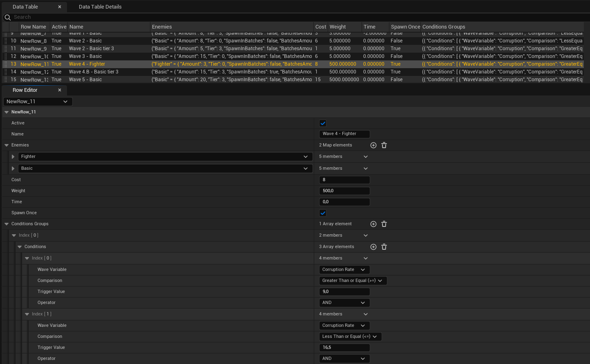
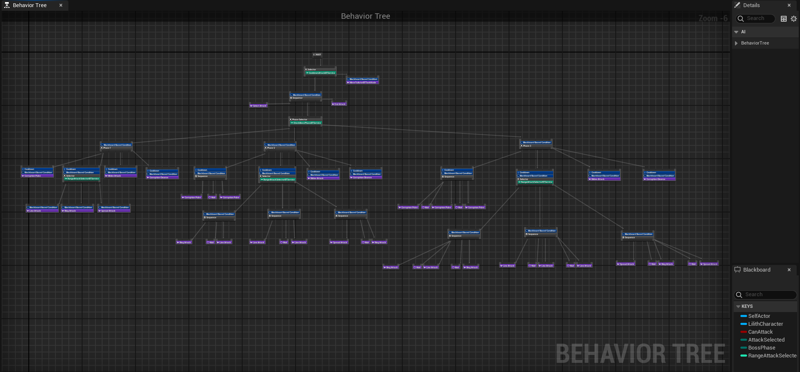

### Summary

**Lilith: Rise of the Fallen** is my Master's Thesis for my Master's Degree in Video Game Porgramming at the UCM, where I worked with a group of programmers, desingers, artists and producers to create this game in Unreal Engine 5.

Lilith takes inspiration in games like Vampire Survivors, Death Must Die and 20 Minutes Till Dawn, where the player has to survive hordes of enemies while it upgrades his abilities and unlockes new ones that attack the enemies automatically. In Lilith we decided to amplify the gameplay of this types of games, adding a new mecanic of corruption similar to Splatoon, where the player has to "paint" as much of the map as possible to win.

### Contribution

I was able to work in many parts of the game, but my main work was in:

  - **Corruption System**
    - **Map Corruption:** Main mecanic, giving the ability to the player to corrupt the map. Implemented using an **Hexagonal Grid**.
    - **Corruption Effects:** Applied debuff (p.e. slow, vulnerable, charm) to the enemies while on top of the corruption.
    - 
        
      
  - **Waves System**
    - **Waves Spawn**: Spawn of waves in a timer, with each waves having a cost to be spawn, seconds added or substracted to said timer and conditions to be spawn dependant of other variables like Enemies in Play or Time Played.
    - **Waves Creation Tool:** Tool for desingers to create custom waves of enemies with different conditions to spawn, types of enemies and all that was necessary on our wave system.
      
        
      
  - **AI**
    - **Boss**: Boss AI usign Unreal's Behaviour Trees. Four differents attacks depending on weigths and distance to the player, attack patterns changes with the boss health.
    
      

      
    
    - **Cleaner**: Enemies that dedicate to rid the floor of corruption. Implemented detection of nearest corruption with line of sigth algorithms.
    
      
    
    - **Charm**: Enemies can be affected by a charm effect that makes them attack their allies and work for a little time to the player side. Implemented closest enemy detection and other mechanic for it to work properly.

      
      
  - **Player Abilities**
    - **Sloth:** Objects that orbit around the player and grow if the player doesnt dash, going back to their original form when it does.
    - **Lust:** Whips that appear from the player attacking the nearest enemy, charming every enemy it hits.
  - **Logging:** Saved gameplay data for analisys with a logging system
  - **UI:** Main menu, loading levels and various UI implementation
